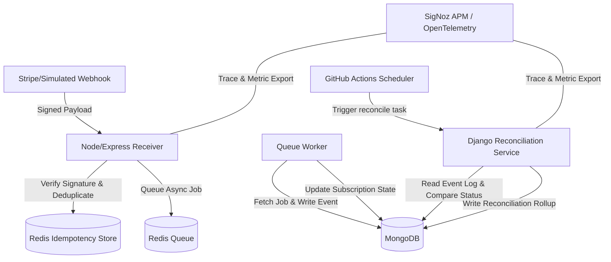

# WebhookGuard

WebhookGuard is a webhook receiver + reconciliation system that monitors and verifies the delivery and execution integrity of webhooks. It is designed to solve the "silent webhook failure" problem—where a third-party service (like Stripe) sends a webhook, the receiver acknowledges it with a `200 OK`, but the underlying business logic fails or gets skipped (no state update occurs).

This project was built for the **Agents of SigNoz** hackathon (WeMakeDevs × SigNoz) using a multi-backend service architecture instrumented with OpenTelemetry and monitored via SigNoz.

## The Problem
Stripe (and similar API services) retry webhooks if they receive errors. However, if a webhook receiver returns a `200 OK` but silently fails to update the user's subscription state (e.g., due to database locks, race conditions, or logic errors), no exception is thrown and no standard API monitoring catches it. Founders lose revenue because billing state updates (such as revoking access on subscription cancelation) are silently dropped.

## Architecture & How It Works


1. **Webhook Receiver (`/webhook-service`)**: Node.js + Express (TypeScript) service. Accepts Stripe-style signed webhook payloads, verifies HMAC signatures using a shared secret, checks Redis for idempotency to deduplicate, queues jobs, and returns a `200 OK` immediately.
2. **Queue Worker (`/webhook-service`)**: Asynchronously processes the queue (using BullMQ), logs events in MongoDB, and applies state changes (e.g. updating active subscription status). Supports a "buggy mode" toggle to simulate silent drift.
3. **Reconciliation Service (`/reconciliation`)**: A Python + Django service that periodically scans the MongoDB event log and matches acknowledged events against current subscription records, marking events as reconciled or flagging drift.
4. **GitHub Actions**: Triggers the Django reconciliation service periodically (or on-demand).
5. **Observability (`/infra`)**: Uses OpenTelemetry across services to export traces and metrics to a self-hosted **SigNoz** instance. Traces track the execution flow from receipt to state write, reporting silent anomalies via custom metrics (`drift_rate`, `dollars_at_risk`) and triggers alerts.

## Project Structure
```
/frontend        - Next.js dashboard showing subscription state and drift warnings
/webhook-service - Express webhook receiver and queue processor (TypeScript)
/reconciliation  - Django reconciliation engine (Python)
/infra           - SigNoz deployment configuration and compose manifests
/PROJECT_CONTEXT.md - Repository metadata, API contracts, and build log
```

## Getting Started

Detailed running instructions for individual services are documented in their respective directories and in the project's [PROJECT_CONTEXT.md](file:///d:/signoz/PROJECT_CONTEXT.md).

### Prerequisites
- Docker & Docker Compose
- Node.js (v18+)
- Python (v3.10+)
- MongoDB & Redis (or run via the provided local docker-compose stack)

### Quick Start (Local Services)
Detailed local setup instructions can be found in the infrastructure directory.
